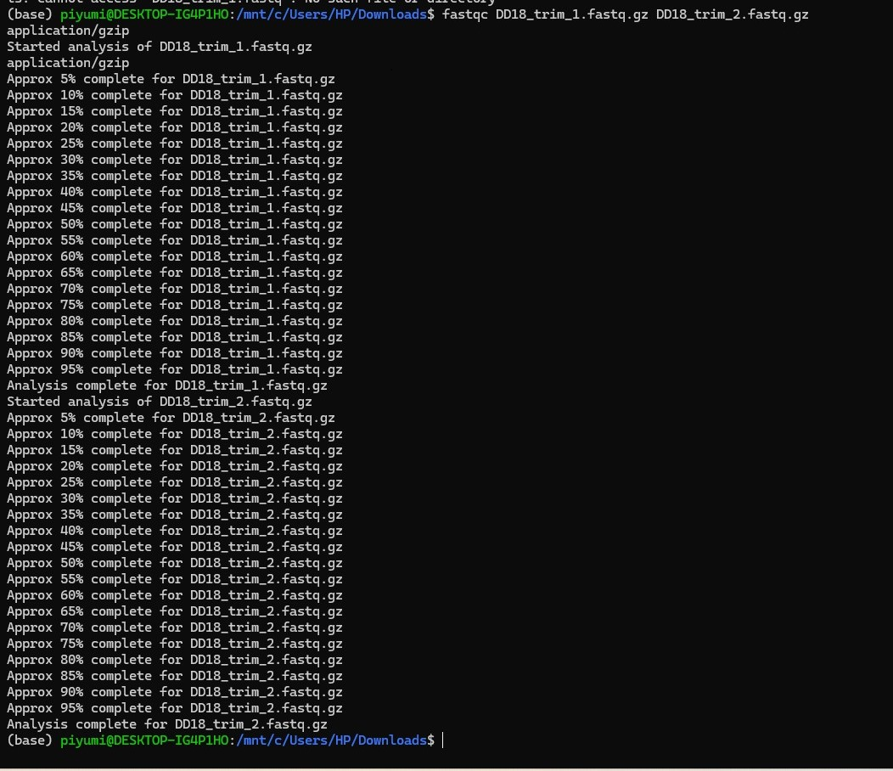

# Quality Control

## Overview

This section describes the quality assessment of raw Illumina paired-end sequencing reads prior to genome assembly.

---

## Objective

- Assess the quality of raw Illumina sequencing reads.
- Identify potential sequencing issues.
- Evaluate base quality, GC content, sequence duplication, and adapter contamination.
- Ensure sequencing data are suitable for downstream genome assembly.

---

## Input Data

- Forward Illumina paired-end reads (FASTQ)
- Reverse Illumina paired-end reads (FASTQ)

---

## Software

| Software | Purpose |
|----------|---------|
| FastQC | Assess sequencing read quality |

---

## Operating System

- Linux (WSL Ubuntu)

---

## Methodology

Raw Illumina paired-end sequencing reads were analyzed using FastQC to evaluate sequencing quality before genome assembly. The analysis included per-base sequence quality, GC content, sequence duplication levels, adapter contamination, and overrepresented sequences.

---

## Representative Command

```bash
fastqc DD18_trim_1.fastq.gz DD18_trim_2.fastq.gz
```
## Representative Screenshot

The screenshot below shows the successful execution of FastQC on the forward (DD18_trim_1.fastq.gz) and reverse (DD18_trim_2.fastq.gz) Illumina paired-end sequencing reads.



---

## Output

- HTML quality report
- ZIP archive containing quality statistics

---

## Interpretation

The FastQC reports were examined to verify that the sequencing reads were of sufficient quality for de novo genome assembly.

---

## References

Andrews, S. (2010). FastQC: A Quality Control Tool for High Throughput Sequence Data.
