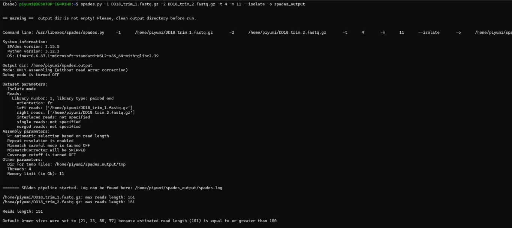
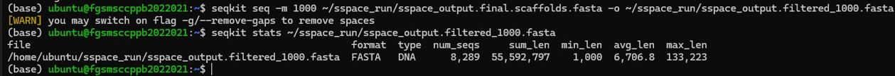
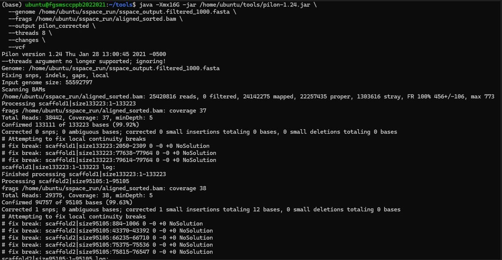

# Genome Assembly

## Overview

This section describes the genome assembly workflow used to reconstruct the genome of *Perenniporia cf. tephropora* DD18 from Illumina paired-end sequencing data. The workflow consisted of de novo genome assembly using SPAdes, followed by scaffolding with SSPACE to improve assembly continuity. The scaffold assembly was subsequently filtered using SeqKit to remove scaffolds shorter than 1000 bp and polished using Pilon to improve assembly accuracy, resulting in a high-quality draft genome assembly suitable for downstream analyses.

---

## Objectives

- Assemble high-quality Illumina paired-end sequencing reads into genome contigs.
- Improve genome assembly continuity through scaffolding.
- Remove short scaffold sequences to reduce assembly fragmentation.
- Correct assembly errors through genome polishing.
- Generate a reliable draft genome assembly for downstream genome annotation and comparative genomic analyses.

---

## Input Data

- Forward paired-end reads (`DD18_trim_1.fastq.gz`)
- Reverse paired-end reads (`DD18_trim_2.fastq.gz`)

---

## Bioinformatics Workflow

```
Raw Illumina Paired-End Reads
            │
            ▼
          SPAdes
     (De novo assembly)
            │
            ▼
         Contigs
            │
            ▼
          SSPACE
      (Scaffolding)
            │
            ▼
     Scaffold Assembly
            │
            ▼
          SeqKit
(Filter scaffolds ≥1000 bp)
            │
            ▼
          Pilon
(Assembly polishing)
            │
            ▼
Final Draft Genome Assembly
```

---

# SPAdes

## Purpose

SPAdes was used to assemble quality-assessed Illumina paired-end sequencing reads into contiguous genome sequences (contigs).

## Software

- SPAdes v3.15.5

## Why was SPAdes used?

SPAdes is a de Bruijn graph-based genome assembler designed for assembling short-read sequencing data. It generates high-quality contigs that serve as the foundation for downstream scaffolding.

## Representative Command

```bash
spades.py \
-1 DD18_trim_1.fastq.gz \
-2 DD18_trim_2.fastq.gz \
-t 4 \
-m 16 \
-o spades_output
```

## Representative Image

The following screenshot shows the successful execution of SPAdes during de novo genome assembly.



## Output

- `contigs.fasta`

---

# SSPACE

## Purpose

SSPACE Basic v2.1 was used to improve genome assembly continuity by linking contigs into scaffolds using paired-end sequencing information.

## Software

- SSPACE Basic v2.1
- Bowtie v1.3.1
- Bash

## Why was SSPACE used?

Genome assemblies generated by SPAdes often consist of numerous contigs. SSPACE uses paired-end read information to identify relationships between contigs and joins them into longer scaffold sequences, thereby improving assembly continuity.

## Workflow

- Validate paired-end FASTQ files.
- Split large FASTQ files into smaller paired chunks.
- Automatically generate `library.txt`.
- Map paired-end reads to contigs using Bowtie.
- Scaffold contigs using SSPACE.

## Representative Command

```bash
perl SSPACE_Basic.pl \
-l library.txt \
-s contigs.fasta \
-x 0 \
-k 5 \
-a 0.7 \
-T 12 \
-b sspace_output
```

## Representative Image

The following screenshot shows the successful execution of SSPACE Basic v2.1, including Bowtie indexing, paired-end read mapping, and scaffold construction.


## Input

- `contigs.fasta`
- `library.txt`

## Output

- `sspace_output.final.scaffolds.fasta`

---

# SeqKit

## Purpose

SeqKit was used to filter the scaffold assembly by removing scaffold sequences shorter than **1000 bp**. This filtering step reduced assembly fragmentation and retained longer scaffold sequences for downstream genome polishing and annotation.

## Software

- SeqKit

## Why was SeqKit used?

Genome scaffolding frequently generates short scaffold fragments that may represent fragmented or low-confidence sequences. Removing scaffolds shorter than **1000 bp** improves assembly quality and provides a cleaner genome assembly for downstream analyses.

## Representative Command

```bash
seqkit seq -m 1000 \
~/sspace_run/sspace_output.final.scaffolds.fasta \
-o ~/sspace_run/sspace_output.filtered_1000.fasta
```

## Representative Image

The following screenshot shows the successful execution of SeqKit filtering and verification of the filtered scaffold assembly statistics.



## Input

- `sspace_output.final.scaffolds.fasta`

## Output

- `sspace_output.filtered_1000.fasta`

---

# Pilon

## Purpose

Pilon was used to polish the filtered scaffold assembly by correcting sequencing and assembly errors using Illumina paired-end reads mapped back to the genome assembly.

## Software

- Pilon

## Why was Pilon used?

Although scaffolding improves assembly continuity, small assembly errors such as base substitutions, insertions, deletions, and local misassemblies may still remain. Pilon uses aligned Illumina reads to identify and correct these errors, producing a more accurate genome assembly suitable for downstream annotation and comparative genomic analyses.

## Representative Command

> **Replace the command below with the exact Pilon command you executed.**

```bash
java -jar pilon.jar \
--genome sspace_output.filtered_1000.fasta \
--frags aligned_reads.sorted.bam \
--output pilon_output
```

## Representative Screenshot

The following screenshot shows the successful execution of Pilon during genome assembly polishing.



## Input

- `sspace_output.filtered_1000.fasta`
- Sorted BAM alignment file

## Output

- Polished genome assembly

---

# Key Outcomes

- Successful de novo genome assembly using SPAdes.
- Improved assembly continuity through SSPACE scaffolding.
- Removal of scaffold sequences shorter than 1000 bp using SeqKit.
- Improved assembly accuracy through genome polishing with Pilon.
- Generation of a high-quality draft genome assembly suitable for downstream quality assessment, genome annotation, phylogenetic analysis, and comparative genomics.

---

# References

Bankevich, A., et al. (2012). **SPAdes: A New Genome Assembly Algorithm and Its Applications to Single-Cell Sequencing.** *Journal of Computational Biology*, 19(5), 455–477.

Boetzer, M., Henkel, C.V., Jansen, H.J., Butler, D., & Pirovano, W. (2011). **Scaffolding pre-assembled contigs using SSPACE.** *Bioinformatics*, 27(4), 578–579.

Shen, W., Le, S., Li, Y., & Hu, F. (2016). **SeqKit: A cross-platform and ultrafast toolkit for FASTA/Q file manipulation.** *PLOS ONE*, 11(10), e0163962.

Walker, B.J., et al. (2014). **Pilon: An integrated tool for comprehensive microbial variant detection and genome assembly improvement.** *PLOS ONE*, 9(11), e112963.
