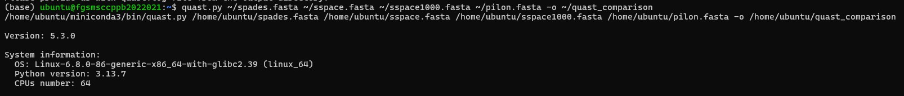
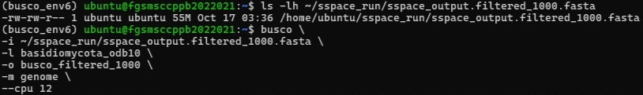

# Genome Assembly Assessment

## Overview

Evaluate the quality, completeness, and reliability of the assembled fungal genome before genome annotation and downstream comparative analyses.

---

## Rationale for Genome Assembly Assessment

Following genome assembly, the quality of the assembled genome must be evaluated to determine whether it is suitable for downstream analyses. In this study, four different genome assemblies generated during the assembly workflow were assessed and compared to identify the most reliable assembly.

Multiple complementary assessment tools were used to evaluate different aspects of assembly quality, including contiguity, completeness, read support, and sequencing depth.

The assessment results were compared across all four genome assemblies to identify the most complete, contiguous, and accurate assembly for downstream analyses, including genome annotation, repeat analysis, and laccase gene characterization.

---

## Bioinformatics Workflow

```
    Assembled genome
            │
            ▼
        QUAST
 (Assembly Statistics)
            │
            ▼
        BUSCO
 (Genome Completeness)
            │
            ▼
        BBMap
(Read Mapping Assessment)
            │
            ▼
      Mosdepth
 (Coverage Analysis)
            │
            ▼
       MultiQC
(Integrated Quality Report)
```

---

## Assessment Tools

### QUAST

#### Purpose
QUAST was used to evaluate assembly contiguity and fragmentation using metrics such as N50, L50, total assembly size, GC content, and number of contigs.

#### Methodology
QUAST v5.3.0 was used to assess four genome assemblies generated during the assembly workflow. The resulting metrics were compared to identify the assembly with the best structural quality.

#### Representative command
```bash
quast.py \
~/spades.fasta \
~/sspace.fasta \
~/sspace1000.fasta \
~/pilon.fasta \
-o ~/quast_comparison
```
#### Representative Screenshot

The figure below shows the QUAST summary comparing the four genome assemblies.



#### Results
| Metric | SPAdes | SSPACE | Filtered (>1000 bp) | Pilon |
|:-------|-------:|--------:|--------------------:|------:|
| Genome size (Mb) | 60.41 | 60.41 | 55.59 | 55.59 |
| Total contigs | 15,627 | 15,627 | 8,289 | 8,289 |
| Largest contig (bp) | 133,223 | 133,223 | 133,223 | 133,223 |
| GC (%) | 54.88 | 54.88 | 54.85 | 54.85 |
| N50 (bp) | 10,705 | 10,705 | **11,930** | 11,927 |
| L50 | 1,540 | 1,540 | **1,326** | 1,326 |

#### Interpretation
Comparison of the four genome assemblies showed that the initial SPAdes and SSPACE assemblies produced similar assembly statistics. Filtering scaffolds shorter than 1000 bp substantially reduced assembly fragmentation and improved continuity, as indicated by an increased N50 (10,705 to 11,930 bp) and a decreased L50 (1,540 to 1,326), while maintaining a stable GC content. These results indicate that scaffold filtering improved assembly quality without altering the overall genome composition.

#### Conclusion
The QUAST analysis demonstrated that filtering scaffolds shorter than 1000 bp substantially improved assembly continuity while maintaining genome composition. The filtered assembly was therefore selected for downstream genome annotation and subsequent analyses.

---

### BUSCO

#### Purpose
BUSCO (Benchmarking Universal Single-Copy Orthologs) was used to assess genome assembly completeness by searching for highly conserved single-copy orthologs from the Basidiomycota lineage dataset, providing a standardized measure of the completeness of the assembled gene space.

#### Methodology
BUSCO v5.7.1 was used to evaluate the completeness of each assembled genome (SPAdes, SSPACE, SSPACE (>1000 bp),	Pilon-polished) using the Basidiomycota lineage dataset (`basidiomycota_odb10`). BUSCO searched the assembly for highly conserved single-copy orthologous genes and classified them as Complete (single-copy or duplicated), Fragmented, or Missing. The resulting completeness metrics were used to assess the quality of the assembled gene space and determine its suitability for downstream genome annotation.

#### Representative command
```bash
busco \
-i filtered_1000.fasta \
-l basidiomycota_odb10 \
-o busco_filtered_1000 \
-m genome \
--cpu 12
```
#### Representative Screenshot

The screenshot below shows the execution of BUSCO v5.7.1 using the Basidiomycota lineage dataset to assess genome assembly completeness.



#### Results
##### BUSCO Completeness Comparison
| BUSCO Metric | SPAdes<br>(BUSCO 5.4.4) | SSPACE<br>(BUSCO 6.0.0) | Filtered (>1000 bp)<br>(BUSCO 6.0.0) | Pilon<br>(BUSCO 6.0.0) |
|:------------|:-----------------------:|:-----------------------:|:------------------------------------:|:----------------------:|
| Complete BUSCOs (C) | 603 (79.5%) | 1452 (82.3%) | 1437 (81.5%) | 603 (79.6%) |
| Complete and single-copy BUSCOs (S) | 376 (49.6%) | 878 (49.8%) | 874 (49.5%) | 349 (46.0%) |
| Complete and duplicated BUSCOs (D) | 227 (29.9%) | 574 (32.5%) | 563 (31.9%) | 254 (33.5%) |
| Fragmented BUSCOs (F) | 94 (12.4%) | 218 (12.4%) | 190 (10.8%) | 96 (12.7%) |
| Missing BUSCOs (M) | 61 (8.1%) | 94 (5.3%) | 137 (7.8%) | 59 (7.8%) |
| Total BUSCO groups searched (n) | 758 | 1764 | 1764 | 758 |
| Genes with internal stop codons (%) | – | 10.9% | 11.0% | 12.4% |
| Internal stop codons (count) | – | 158 | 158 | 75 |

#### Interpretation
The filtered genome assembly achieved 81.5% complete BUSCOs, including 49.5% single-copy and 31.9% duplicated orthologs. Only 10.8% of BUSCO genes were fragmented, while 7.8% were missing, indicating good representation of the conserved fungal gene space. Approximately 11.0% of complete BUSCOs contained internal stop codons, suggesting that a small proportion of predicted genes may require further refinement.

#### Conclusion
BUSCO analysis demonstrated that the filtered assembly contained the majority of conserved Basidiomycota genes with relatively low fragmentation, supporting its suitability for downstream genome annotation and functional analyses.
---

### BBMap

BBMap was used to align the quality-filtered Illumina paired-end sequencing reads back to the assembled genome. Read mapping statistics provide an indication of assembly accuracy, mapping efficiency, and how well the assembled genome represents the original sequencing data.

---

### Mosdepth

Mosdepth was used to estimate sequencing depth across the assembled genome using mapped sequencing reads. Genome coverage analysis helps evaluate sequencing depth uniformity and supports the reliability of the assembled genome.

---

### MultiQC

MultiQC was used to summarize outputs generated by multiple genome assessment tools into a single interactive report, allowing efficient visualization and interpretation of assembly quality metrics.

---

## Key Outcomes

- Assembly statistics were evaluated using QUAST.
- Genome completeness was assessed using BUSCO.
- High read mapping efficiency was confirmed using BBMap.
- Genome sequencing depth was estimated using Mosdepth.
- Quality assessment reports were summarized using MultiQC.
- The combined assessment demonstrated that the assembled genome was suitable for downstream genome annotation and comparative genomic analyses.

---

## Repository Structure

- **QUAST.md** – Assembly statistics assessment
- **BUSCO.md** – Genome completeness assessment
- **BBMap.md** – Read mapping assessment
- **Mosdepth.md** – Genome coverage analysis
- **MultiQC.md** – Integrated quality assessment report

---

## References

Gurevich, A., Saveliev, V., Vyahhi, N., & Tesler, G. (2013). QUAST: Quality Assessment Tool for Genome Assemblies. *Bioinformatics*, 29(8), 1072–1075.

Manni, M., Berkeley, M. R., Seppey, M., Simão, F. A., & Zdobnov, E. M. (2021). BUSCO Update: Novel and Streamlined Workflows Along with Broader and Deeper Phylogenetic Coverage for Scoring of Eukaryotic, Prokaryotic, and Viral Genomes. *Molecular Biology and Evolution*, 38(10), 4647–4654.

Bushnell, B. BBMap: A Fast and Accurate Short Read Aligner. Lawrence Berkeley National Laboratory.

Pedersen, B. S., & Quinlan, A. R. (2018). Mosdepth: Quick Coverage Calculation for Genomes and Exomes. *Bioinformatics*, 34(5), 867–868.

Ewels, P., Magnusson, M., Lundin, S., & Käller, M. (2016). MultiQC: Summarize Analysis Results for Multiple Tools and Samples in a Single Report. *Bioinformatics*, 32(19), 3047–3048.
