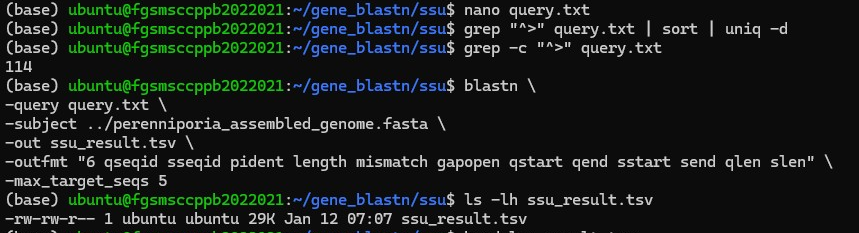
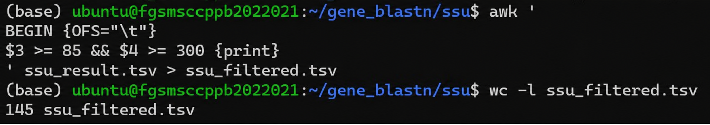
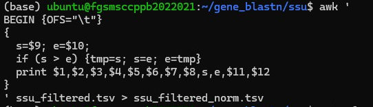
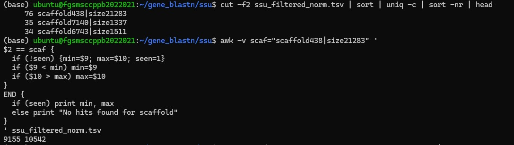
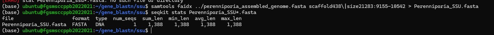

# Barcoding Gene Extraction and BLASTn Validation

## Overview

This module demonstrates the workflow used to extract conserved fungal DNA barcode genes from a draft genome assembly and validate their identities using NCBI BLASTn. The validated marker genes were subsequently used for downstream analyses.

## Rationale

Conserved DNA barcode genes are widely used for fungal species identification and phylogenetic analyses. Although these genes are expected to be present in the assembled genome, their identities should be verified before they are used in downstream analyses. This workflow demonstrates the extraction of representative barcode genes from the genome assembly and their validation against the NCBI nucleotide database using BLASTn. Confirming sequence identity ensures that the recovered markers are suitable for comparative and phylogenetic studies.

## Workflow
```
Genome Assembly
↓
Barcode Gene Extraction
↓
Selection of Candidate Regions
↓
NCBI BLASTn Validation
↓
Evaluation of Sequence Similarity
↓
Validated Marker Genes
```
## Barcode Gene Extraction

### Purpose
The assembled genome was examined to identify candidate regions corresponding to conserved fungal DNA barcode genes, including ITS, LSU, SSU, TEF1, β-tubulin, and RPB2.

### Step 1 – Identify Candidate Gene Regions

#### Purpose
Identify candidate genomic regions containing the target barcode gene by aligning a reference gene sequence against the assembled genome using BLASTn.

#### Representative command
```
blastn \
-query query.txt \
-subject perenniporia_assembled_genome.fasta \
-out blast_results.tsv \
-outfmt "6 qseqid sseqid pident length mismatch gapopen qstart qend sstart send qlen slen" \
-max_target_seqs 5
```

#### Representative Screenshot 

Figure 1. Running BLASTn to identify candidate genomic regions corresponding to the target barcode gene in the assembled genome.



#### Interpretation
BLASTn identified multiple candidate alignments between the reference barcode gene and the assembled genome. These candidate regions were used for subsequent filtering and coordinate analysis.

### Step 2 – Filter High-Confidence Alignments

#### Purpose
Filter BLAST results to retain only high-confidence alignments based on sequence identity and alignment length.

#### Representative command
```bash
awk 'BEGIN {OFS="\t"}
$3>=85 && $4>=300 {print}
' ssu_result.tsv > ssu_filtered.tsv
```
#### Representative Screenshot 

Figure 2. Filtering BLASTn alignments based on sequence identity and alignment length.



#### Interpretation
Filtering removed low-confidence matches and retained only candidate alignments meeting the predefined similarity criteria for downstream analysis.

### Step 3 – Normalize Alignment Coordinates

#### Purpose
Normalize genomic coordinates to ensure that sequence extraction is performed using correctly ordered start and end positions.

#### Representative Command
```bash
awk '
BEGIN{OFS="\t"}
{
s=$9; e=$10;
if (s>e){tmp=s; s=e; e=tmp}
print $1,$2,$3,$4,$5,$6,$7,$8,s,e,$11,$12
}' ssu_filtered.tsv > ssu_filtered_norm.tsv
```

#### Representative Screenshot 

Figure 3. Running BLASTn to identify candidate genomic regions corresponding to the target barcode gene in the assembled genome.



#### Interpretation
Coordinate normalization corrected alignments reported on the reverse strand, ensuring accurate genomic coordinates for sequence extraction.

### Step 4 – Identify the Final Genomic Region

#### Purpose
Determine the scaffold containing the barcode gene and identify the genomic interval corresponding to the complete candidate region (minimum start and maximum end positions for the gene.).

#### Representative Command 
```bash
cut -f2 ssu_filtered_norm.tsv | sort | uniq -c | sort -nr | head
```

```bash
awk -v scaf="scaffold438|size21283" '
$2==scaf {
if(!seen){min=$9; max=$10; seen=1}
if($9<min) min=$9
if($10>max) max=$10
}
END{
if(seen) print min, max
else print "No hits found"
}' ssu_filtered_norm.tsv
```

#### Representative Screenshot 

Figure 4. Identification of the scaffold with the highest number of BLAST hits and determination of the genomic coordinates for sequence extraction.



#### Interpretation
Extract the nucleotide sequence corresponding to the identified genomic coordinates from the assembled genome.

### Step 5 – Extract the Gene Sequence

#### Purpose
Extract the nucleotide sequence corresponding to the identified genomic coordinates from the assembled genome.

#### Representative Command
```bash
samtools faidx \
../perenniporia_assembled_genome.fasta \
scaffold438:9155-10542 \
> Perenniporia_SSU.fasta
```
#### Representative Screenshot 

Figure 5. Extraction of the target barcode gene sequence from the assembled genome using Samtools `faidx`, followed by verification of the extracted FASTA sequence using SeqKit. The extracted sequence was successfully saved in FASTA format and its basic sequence statistics were confirmed.



#### Interpretation
The target barcode gene sequence was successfully extracted from the assembled genome using the genomic coordinates identified in the previous step. SeqKit confirmed that a single FASTA sequence was generated and provided basic sequence statistics, verifying that the extracted sequence was complete and correctly formatted for downstream BLASTn validation and phylogenetic analyses.

## NCBI BLASTn Validation of Extracted Marker Genes

### Purpose

Conserved DNA barcode genes are widely used for fungal species identification and phylogenetic analyses. However, before these genes can be used, they must first be accurately recovered from the assembled genome and their identities verified. This workflow was performed to identify genomic regions corresponding to six commonly used fungal barcode genes (ITS, LSU, SSU, TEF1, β-tubulin, and RPB2), extract their nucleotide sequences, and validate them against reference sequences in the NCBI nucleotide database using BLASTn.

The workflow involved searching the assembled genome with reference gene sequences, filtering high-confidence alignments, determining the genomic coordinates of the target genes, extracting the corresponding nucleotide sequences, and confirming their identities through sequence similarity analysis. The validated barcode gene sequences were then used as reliable molecular markers for downstream phylogenetic analyses.

### Workflow
```
Extracted Marker Gene Sequence (FASTA)
              │
              ▼
Prepare BLASTn Query
              │
              ▼
Search Against NCBI Nucleotide Database
              │
              ▼
Retrieve Significant BLAST Hits
              │
              ▼
Evaluate Sequence Similarity
(Identity, Query Coverage & E-value)
              │
              ▼
Confirm Marker Gene Identity
              │
              ▼
Validated Marker Gene for Downstream Analysis
```

#### Representative Output

**Table X.** Representative summary of NCBI BLASTn validation for the extracted fungal barcode genes. Each extracted marker gene was compared against the NCBI nucleotide database, and the best sequence match was used to confirm gene identity. All marker genes showed high similarity to reference sequences of *Perenniporia tephropora* or its currently accepted name, *Truncospora tephropora*, confirming successful sequence validation.

| Marker Gene | Best Match                 | Similarity Level | Validation Status |
|--------------|----------------------------|------------------|-------------------|
| ITS          | *Perenniporia tephropora*  | High             | ✓ Validated       |
| LSU          | *Perenniporia tephropora*  | High             | ✓ Validated       |
| SSU          | *Perenniporia tephropora*  | High             | ✓ Validated       |
| TEF1         | *Perenniporia tephropora*  | High             | ✓ Validated       |
| β-tubulin    | *Truncospora tephropora*   | High             | ✓ Validated       |
| RPB2         | *Truncospora tephropora*   | High             | ✓ Validated       |

#### Conclusion

The extracted fungal barcode genes were successfully validated using NCBI BLASTn by comparison with reference sequences in the NCBI nucleotide database. The validation confirmed the identities of the recovered marker genes and demonstrated the reliability of the extraction workflow. The validated sequences were subsequently used for downstream phylogenetic analyses, providing a robust workflow for marker gene recovery and verification from fungal genome assemblies.
